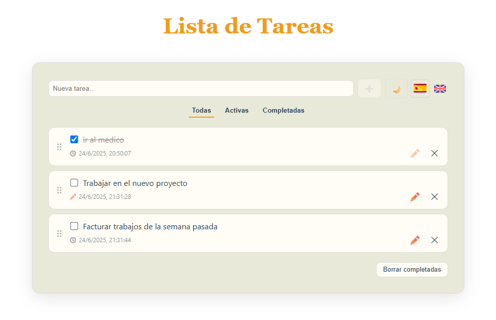

# 📘 Todo List

[](https://github.com/KVOTHE73/todo-list/actions/workflows/ci.yml)

Una aplicación moderna y elegante construida con **Vue 3**. Permite gestionar tareas con funciones avanzadas como filtros, traducción en tiempo real, modo oscuro/claro y reordenamiento visual, además de todas las funciones CRUD (creación, edición, actualización y eliminado de tareas). Este proyecto forma parte de mi portfolio y está diseñado para mostrar una implementación profesional de un componente Vue autocontenible.




---

## 🚀 Tecnologías utilizadas

- [Vue 3](https://vuejs.org/) + Composition API
- [Typescript](https://www.typescriptlang.org/) — Javascript superset
- [vue-i18n](https://github.com/markedjs/marked) — Sistema de traducciones dinámico
- [localStorage API](https://highlightjs.org/) — Persistencia de datos
- [tailwind](https://tailwindcss.com/) + CSS puro con variables para tema claro/oscuro
- [vitest](https://vitest.dev/) - Tests unitarios del componente

---

## 🗂️ Estructura principal

```
src/
├── components/
│   └── TodoList.vue     # Componente principal de tareas
├── assets/
│   └── flags/           # Banderas de idiomas
├── locales/
│   ├── en.json
│   └── es.json
├── App.vue              # Componente raíz
├── main.ts              # Punto de entrada
└── ...
```

---

## ✨ Funcionalidades

- 🎨 Tema claro / oscuro persistente
- 🌐 Soporte multilenguaje (Español / Inglés)
- ✅ Agregar, editar, eliminar tareas
- 🗂️ Filtros: todas, activas, completadas
- ✏️ Tareas editables con registro de modificación
- 📦 Almacenamiento en `localStorage`
- 🔀 Reordenamiento por **Drag & Drop**
- 📆 Fecha de creación o edición visible
- 📱 Responsive y optimizado para móviles

---

## 🧩 Estructura del componente

- `template`: Vista con toolbar, pestañas y paneles
- `script setup`: Lógica clara, organizada por bloques funcionales
- `style`: Completamente comentado y contenido en el propio archivo
- ✅ No requiere ningún CSS externo adicional

---

## 🛠️ Instalación y uso

```bash
# Clona el repositorio
git clone https://github.com/KVOTHE73/todo-list.git
cd todo-list

# Instala dependencias
npm install

# Ejecuta en modo desarrollo
npm run dev
```

📅 Metainformación

📁 Proyecto: ToDo List

🧠 Autor: [Nacho Rodríguez](https://www.nacho-rodriguez.com)

📦 Tipo: Componente Vue 3 autocontenible

🎯 Finalidad: Portfolio personal / Demostración de habilidades frontend

🔗 Licencia: MIT

📣 Puedes ver una demo en vivo aquí:
👉 https://kvothe73.github.io/todo-list
